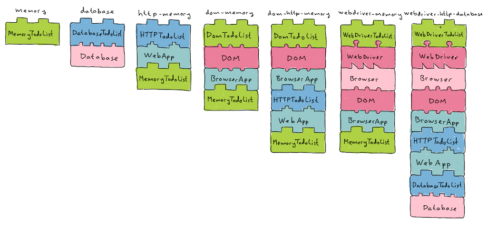

# Assembly Runner

La intención de este paquete es proveer un mecanismo extensible que facilite la construcción y uso de distintos assemblies en pruebas automatizadas.

## ¿Que es un Assembly?

La idea de Assembly está tomada de la arquitectura hexagonal (o Ports and Adapters).



_Fuente: [Subsecond TDD](https://github.com/subsecondtdd/todo-subsecond)_

En la imagen, cada conjunto de bloques representa un assembly. Estos pueden configurarse para crear múltiples variantes que ejercitan el sistema a distintos niveles de profundidad.

## Uso

### Denifir el Lineup

Al conjunto de assemblies disponibles lo llamamos Lineup. El Lineup es un array de objetos que deben cumplir con el sguiente contrato:

1. Tener nombre
1. Lista de adaptadores. (Podría no tener ninguno. Sería el caso donde se prueba al sistema de punta a punta y no se adapta ninguna de sus partes).
1. Drivers. La liste de objetos que van a guiar o ejecutar la prueba. (Podría usar un web driver si voy a interactuar con la web o un http driver si voy a interactuar con http, para ejercitar un servicio rest por ejemplo)

Ejemplo:

```typescript
const lineup = [
  {
    name: "mock-api",
    adapters: [
      {
        name: "mock-api",
        constructor: (page: Page) => new MockApiAdapter(page),
      },
    ],
    drivers: [
      {
        name: "bienvenida",
        constructor: (_: APIRequestContext, page: Page) =>
          new BienvenidaPlaywrightDriver(page),
      },
      {
        name: "grupos",
        constructor: (_: APIRequestContext, page: Page) =>
          new GruposPlaywrightDriver(page),
      },
    ],
  },
  {
    name: "e2e",
    adapters: [],
    drivers: [
      {
        name: "bienvenida",
        constructor: (_: APIRequestContext, page: Page) =>
          new BienvenidaPlaywrightDriver(page),
      },
      {
        name: "grupos",
        constructor: (_: APIRequestContext, page: Page) =>
          new GruposPlaywrightDriver(page),
      },
    ],
  },
] as const satisfies Lineup;
```

### Crear el assembly

Al ejecutar los tests, es necesario utilizar un assembly específico. Este paquete tiene como objetivo simplificar la selección y configuración de un assembly, permitiendo que un test se ejecute en cualquiera de los assemblies definidos en el Lineup.

Ejemplo:

```typescript
    const assembly = lineup.find((a) => a.name === 'e2e');

    let testAssembly = TestAssemblyFactory(assembly, {
      adaptersConstructorArgs: [page],
      driversConstructorArgs: [request, page],
    });
```